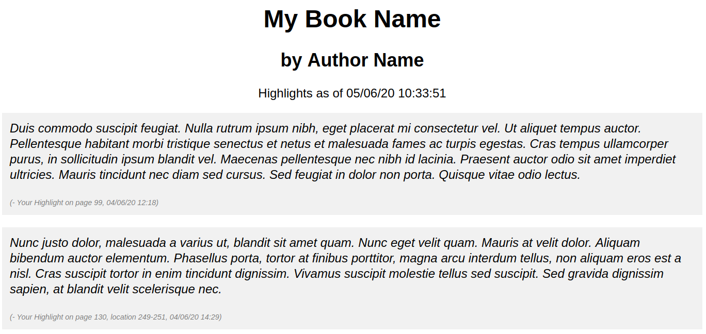
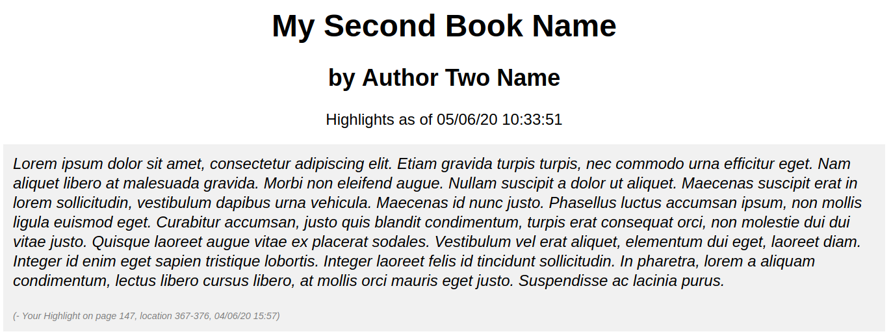

# Kindle Clipping Formatter
A simple tool to convert Kindle Clippings from the native txt format to formatted HTML documents.

Takes the MyClippings.txt file produced by the Kindle device and for each book in this, produces a HTML document with all highlights relating to this book. The page/location reference along with highlight date are added below each highlight.


## Example

For MyClippings.txt Contents:

```text
My Book Name (Author Name)
- Your Highlight on page 99 | Added on Thursday, 4 June 2020 12:18:46

Duis commodo suscipit feugiat. Nulla rutrum ipsum nibh, eget placerat mi consectetur vel. Ut aliquet tempus auctor. Pellentesque habitant morbi tristique senectus et netus et malesuada fames ac turpis egestas. Cras tempus ullamcorper purus, in sollicitudin ipsum blandit vel. Maecenas pellentesque nec nibh id lacinia. Praesent auctor odio sit amet imperdiet ultricies. Mauris tincidunt nec diam sed cursus. Sed feugiat in dolor non porta. Quisque vitae odio lectus. 
==========
My Book Name (Author Name)
- Your Highlight on page 130 | location 249-251 | Added on Thursday, 4 June 2020 14:29:36

Nunc justo dolor, malesuada a varius ut, blandit sit amet quam. Nunc eget velit quam. Mauris at velit dolor. Aliquam bibendum auctor elementum. Phasellus porta, tortor at finibus porttitor, magna arcu interdum tellus, non aliquam eros est a nisl. Cras suscipit tortor in enim tincidunt dignissim. Vivamus suscipit molestie tellus sed suscipit. Sed gravida dignissim sapien, at blandit velit scelerisque nec. 
==========
My Second Book Name (Author Two Name)
- Your Highlight on page 147 | location 367-376 | Added on Thursday, 4 June 2020 15:57:19

Lorem ipsum dolor sit amet, consectetur adipiscing elit. Etiam gravida turpis turpis, nec commodo urna efficitur eget. Nam aliquet libero at malesuada gravida. Morbi non eleifend augue. Nullam suscipit a dolor ut aliquet. Maecenas suscipit erat in lorem sollicitudin, vestibulum dapibus urna vehicula. Maecenas id nunc justo. Phasellus luctus accumsan ipsum, non mollis ligula euismod eget. Curabitur accumsan, justo quis blandit condimentum, turpis erat consequat orci, non molestie dui dui vitae justo. Quisque laoreet augue vitae ex placerat sodales. Vestibulum vel erat aliquet, elementum dui eget, laoreet diam. Integer id enim eget sapien tristique lobortis. Integer laoreet felis id tincidunt sollicitudin. In pharetra, lorem a aliquam condimentum, lectus libero cursus libero, at mollis orci mauris eget justo. Suspendisse ac lacinia purus. 
==========
```

Produces two HTML files in the output directory:

`My Book Name.html`:



`My Second Book Name.html`:


